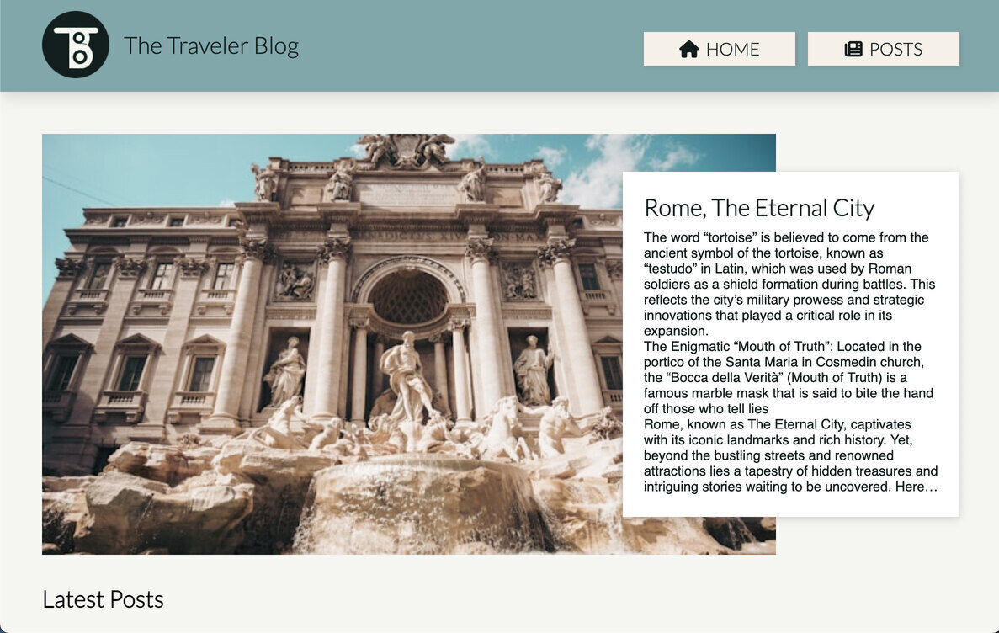

# The Traveler Blog

The Project Exam 1 at Noroff University in Norway was a project using all the skills learned up to the point of the project. The idea behind making it a blog post came from my own love for traveling, using my passion and love for coding I used all my design knowledge to make the website as mathematically appealing as possible. This Project represents my passion and love for both the technical and theoretical side of web-development.



Explore the website by visiting the link - [My Project Exam](https://the-traveler-blog.netlify.app/)

## Key Features

- All posts are fetched from a WordPress account
- Home Page shows latest posts, additional to featured post and first few of a certain continent
- List of Posts Page displays 10 posts until you click on load more, you can also filter through the posts
- Specifics Page shows the fetched data and images that are clickable
- Contact Page allows you to contact me in the near future
- About Page shows a backstory to the blog post website

## Built With

- Visual Studio Code

## Getting Started

### Installing:

1. Clone the repo:

```bash
git clone https://github.com/Nikita-stud/project-exam-1
```

2. Install the dependencies:

```bash
npm install
```

### Running

To run the app, run the following commands:

```bash
npm run start
```

## Future Improvements

- Make the carousel respond better and more jump so much but rather move from object to object
- Making the Specifics Page react better to the text added
- Adding alt text to img on WordPress
- Make the contact form actually send the email to my email and only display unfilled errors
- Changing the main colors

## Contact

You can always contact me though email or my phone number.

nikita151998@gmail.com
<br>
+4745588474
